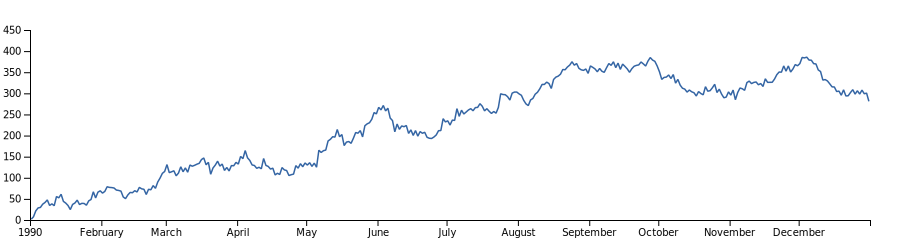

# elm-visualization - An Introduction

By Jakub Hampl (@gampleman)

Welcome to elm-visualization! In this introduction I'll briefly explain the concepts behind elm-visualization, some of the prerequisite knowledge. I'll also point you to some learning resources.

The best way to understand elm-visualization is as a standard library for data visualization. It aims to provide all the basic tools you'll need to build any data visualization you might imagine. It is not a framework in the sense that it doesn't provide any structure for you to base your code on, nor is it merely a configurable collection of pre-made charts. It is also decidedly not very high level in its approach. This leads to a distinct set of properties:

1. You control and understand your visualization code. This means that you can have confidence that as requirements (invariably) change, you will not hit a wall where suddenly something is "impossible" because the library doesn't support it out of the box.
2. Simultaneously you have much more granular control over the performance characteristics of your code.
3. You are forced to make more explicit decisions about the graphical style and user affordances. You won't have features just because they were the defaults in the library.
4. Making decisions usually leads to deeper insight into the properties of the data and can lead to more meaningful designs.
5. Making a simple visualization will lead to a relatively large amount of code. Making an unusual or complex visualization won't increase that code that much.
6. Huge flexibility. elm-visualization focuses on composable primitives, so there is little limit on what you can do.

Given these properties, you should consider whether elm-visualization is the right tool for the job. I think it excels at building novel charts, at building charts for "production" where you understand the data being visualized and for data journalism/storytelling. In other words:

- If you are trying to do **exploratory** visualization (i.e. you don't know much about the data), I would recommend either using a tool (like Excel or Tablaux) or using a Grammar of Graphics style library like [gicentre/elm-vegalite](https://package.elm-lang.org/packages/gicentre/elm-vegalite/latest/).
- If you need some specific **well known chart type**, you might have an easier time just using a pre-made package. See the [Elm Package Catalog Visualization Page](https://korban.net/elm/catalog/packages/data/visualisation) to see what's available.

## Prerequisites

Elm-visualization uses a low-level approach. Unfortunately, that means there is quite a lot to learn.

- Most importantly, elm-visualization does very little actual rendering for you. You will have to write your own drawing code. The easiest way to do that in today's Elm is to use SVG. Unfortunately the SVG spec is very large and documentation tends to be somewhat scattered. I hope to write an intro to it soon. In the meantime there is the #svg channel in the Elm slack for questions. For now, I would also recommend the [elm-community/typed-svg](https://elm.dmy.fr/packages/elm-community/typed-svg/latest/) over the [elm/svg](https://elm.dmy.fr/packages/elm/svg/latest/) package.
- Building data visualization requires an understanding of data concepts. Learn about basic statistical concepts, and get some experience with data cleaning and data preparation tasks.
- Finally, you should have a reasonable understanding of front-end programming in Elm. Start with the [guide](https://guide.elm-lang.org) if you don't.

You don't need to be an expert in these topics, but we'll assume basic familiarity with these things in this guide as well as in other elm-visualization material such as the API docs and the examples.

## Learning by Example

One of the main learning resources we provide is the [examples gallery](https://elm-visualization.netlify.app/). I encourage you to browse these. You can bootstrap your project by copy-pasting the example that looks the most like the thing that you are trying to build, then tweak it to do what you want. You can learn a lot by breaking and improving these examples. Once you get a little more experienced, reading the example code can reveal new and interesting techniques that you can apply to your own code.

On a technical note, these examples depend on a [variety of community packages](https://github.com/gampleman/elm-visualization/blob/master/examples/elm.json), so if you see compiler errors (especially about missing modules) when copying these examples, you might need to install some of these dependencies. Alternatively, you can start with [this Ellie](https://ellie-app.com/8592jsvBL2ka1) that should have the dependencies already added.

## Data

One of the first tasks you'll need to do is acquire data into your Elm program. Most of the examples simply hardcode the data as program literals, and indeed this can be a simple way to prototype. However, for many usecases you will likely want to load data from external sources. First you need to understand how you want to model and represent the data in your program, then you will need to write appropriate decoders from the wire format this data comes in. JSON is probably the easiest to work with (and the default elm/json package works very well for this), but CSV is also common ([BrianHicks/elm-csv](https://package.elm-lang.org/packages/BrianHicks/elm-csv/latest/) is a package that can help here). If you are not hosting the data on your own server, than [CORS](https://developer.mozilla.org/en-US/docs/Web/HTTP/CORS) might be something you need to look into.

A related task to decoding is cleaning: you need to decide on what to do with missing data, null data, invalid data and data that is out of bounds.

Once you have the cleaned and decoded data, elm-visualization provides the [`Statistics`](https://elm.dmy.fr/packages/gampleman/elm-visualization/latest/Statistics) module to help you understand the data in question:

```elm
data : List Float
data =
    [ 2, 4, 1, 4, 9 ]


Statistics.extent data --> Just ( 1, 9 )
```

## Scales

The most fundamental tool in all of elm-visualization, that you will use in nearly any data graphic, is the Scale. The purpose of scales is to transform an abstract dimension of data into a visual variables on the screen.

Imagine for example that we have the following dataset:

```elm
people : List { nationality : String, count: Int }
people =
    [ { nationality = "🇨🇳", count = 123 }
    , { nationality = "🇺🇸", count = 95 }
    , { nationality = "🇬🇧", count = 45 }
    , { nationality = "🇨🇿", count = 21 }
    , { nationality = "🇨🇾", count = 4 }
    ]
```

Here we have two dimensions:

- `count`, which we call _quantitative_:

      ```elm
      List.map .count people ---> [ 123, 95, 45, 21, 4 ]
      ```

- and `nationality`, which we call _nominal_ or _categorical_:

  ```elm
  List.map .nationality people ---> [ "🇨🇳", "🇺🇸", "🇬🇧", "🇨🇿", "🇨🇾" ]
  ```

There are many visual variables we can have on the screen. We can encode quantity, difference, similarity, grouping, hierarchy using size, color, position, animation, etc.

In the following bar chart, we encode two abstract dimensions to two visual variables: the _nationality_ dimension is encoded as the bars' vertical position, whereas the _count_ is encoded as the horizontal length of the bars.


```elm
import Scale exposing (ContinuousScale, BandScale, defaultBandConfig)


maxCount : Float
maxCount =
    people
        |> List.map .count
        |> List.maximum
        |> Maybe.withDefault 0
        |> toFloat


xScale : ContinuousScale Float
xScale =
    Scale.linear ( padding, w - padding) ( 0, maxCount )


yScale : BandScale String
yScale =
    List.map .nationality people
        |> Scale.band { defaultBandConfig | paddingInner = 0.1, paddingOuter = 0.2 } ( padding, h - padding )
```

[Scales](https://package.elm-lang.org/packages/gampleman/elm-visualization/latest/Scale) come in many shapes and sizes depending on what kind of abstract dimensions you have and what kind of visual variables you want to encode your marks into. Most scales take 2 (or more) arguments: the visual variables you want to encode (the _range_) and the abstract dimension (the _domain_). For example the `xScale` is configured such that the count of 0 corresponds to the coordinate the chart's left edge, and the `maxCount` corresponds to the chart's right edge.

In the band scale the domain is a list of values (`[ "🇨🇳", "🇺🇸", "🇬🇧", "🇨🇿", "🇨🇾" ]`), while the range is a continous interval. The band scale figures out how to slice that interval into discrete padded bands.

The bars can than be easily rendered as `<rect>` elements using the values that our scales produce for us:

```elm
green : Color
green =
    Color.rgba 0.4609375 0.8359375 0.3046875 0.8

bar : { nationality : String, count : Int } -> Svg msg
bar { nationality, count } =
    g [ class [ "bar" ] ]
        [ rect
            [ x 0
            , y <| Scale.convert yScale nationality
            , height <| Scale.bandwidth yScale
            , width <| Scale.convert xScale (toFloat count)
            , fill <| Paint green
            ]
            []
        , text_
            [ x <| Scale.convert xScale (toFloat count)
            , y <| Scale.convert (Scale.toRenderable identity yScale) nationality
            , textAnchor AnchorEnd
            , dx -5
            , dy 6
            ]
            [ text <| String.fromInt count ]
        ]
```


Now we can simply map over the the data applying this function:

```elm
view : List { nationality : String, count : Int } -> Svg msg
view model =
    svg [ viewBox 0 0 w h ]
        [ g [ class [ "series" ] ] <|
            List.map bar model
        ]
```


Another useful thing that scales provide is the [Axis](https://package.elm-lang.org/packages/gampleman/elm-visualization/latest/Axis) module,
which provides built in axes, which show the encoding explicitly.

```elm
xAxis : Svg msg
xAxis =
    g [ transform [ Translate 0 padding ] ]
        [ Axis.top [] xScale ]


yAxis : Svg msg
yAxis  =
    g [ transform [ Translate padding 0 ] ]
        [ Axis.left [] (Scale.toRenderable identity yScale) ]
```

(the `Scale.toRenderable` is needed specifically for Band scales so that labels on Axes are nicely centered on the bands)


So far our scales have been dealing only with position and size. But there's a lot more that scales can do:

```elm
colorScale : SequentialScale Color
colorScale =
    Scale.sequential Scale.Color.greensInterpolator ( 0, maxCount )
```

This uses a sequential scale which is just like a linear scale, except for the range it relies on an interpolator.
An interpolator is a function that takes a float between 0 and 1 and returns some value. In this case we are using
a built in interpolator from the `Scale.Color` module that ships with _many_ color schemes suitable for dataviz.
(Note that this uses the `Color` type from [avh4/elm-color](https://package.elm-lang.org/packages/avh4/elm-color/latest/)).

Let's modify our bar definition to include these colors:

```elm

bar : { nationality : String, count : Int } -> Svg msg
bar { nationality, count } =
    g [ class [ "bar" ] ]
        [ rect
            [ x 0
            , y <| Scale.convert yScale nationality
            , height <| Scale.bandwidth yScale
            , width <| Scale.convert xScale (toFloat count)
            , fill <| Paint <| Scale.convert colorScale <| toFloat count
            ]
            []
        , text_
            [ x <| Scale.convert xScale (toFloat count) - 5
            , y <| Scale.convert (Scale.toRenderable identity yScale) nationality + 5
            , textAnchor AnchorEnd
            , fill <| Paint <| if count > 60 then Color.white else Color.black
            ]
            [ text <| String.fromInt count ]
        ]
```


Scales are a powerful primitive. You can already use this to build [bar and column charts](https://elm-visualization.netlify.app/barchart/), as well as
[scatterplots](https://elm-visualization.netlify.app/scatterplot/), [boxplots](https://elm-visualization.netlify.app/boxplot/), and other charts.

## Shapes

Some charts require visual marks that aren't provided out of the box with SVG, or are tedious to program manually.

SVG has a number of simple shapes exposed directly as elements, but virtually all complex shapes are expressed through the `<path>`
element. The actual path that is rendered is specified through the `d` attribute with a string consisting of a number of commands.
You can think of these commands as instructing a pen on where and how to move next.

However, in Elm we don't really like stringly-typed data. Hence elm-visualization is designed to be used with the funkily named
[folkertdev/one-true-path-experiment](https://package.elm-lang.org/packages/folkertdev/one-true-path-experiment/latest/)[^1].

[^1]:
    It's named that way because at an early Elm conference a bunch of package authors got together and said "wouldn't it be nice
    if there was a common way to specify paths, rather than everyone making their own?" (At that time elm-visualization had it's own
    path type, which was removed in v2.) Folkert took it on and decided to jokingly call it the One True Path. However, he wasn't super
    confident that it would be universally adopted, so he appended the -experiment at the end. Don't worry about that - the package is on
    its 6th major release and has been stable for years.

A `Path` is then modelled something like this (the actual type is slightly more complicated for performance reasons as well as handling
some corner cases):

```elm
type alias Path =
    List SubPath

type alias SubPath =
    { moveTo : Point, commands: List DrawTo }

type alias Point =
    ( Float, Float )

type DrawTo
    = LineTo Point
    | CurveTo { target: Point, controlPoint1: Point, controlPoint2: Point }
    | QuadraticBezierCurveTo { target : Point, controlPoint : Point }
    | EllipticalArc EllipticalArcArgument
    | ClosePath
```

The package contains a bunch of functionality to construct, manipulate, parse and display these as well as a different representation
more suitable to analysis and other algorithms.

You may want to use the functionality from this package on more advanced projects, but in the meantime you will mostly want the
`Path.element : Path -> List (Attribute msg) -> Svg msg` function to actually display these paths on screen.

Now imagine you want to visualize a time series some financial data:

```elm
type alias Price =
    { date : Time.Posix
    , close : Float
    , lower : Float
    , middle : Float
    , upper : Float
    }
```

We can start by defining some scales:

```elm
xScale : ContinuousScale Time.Posix
xScale =
    data
        |> List.map .date
        |> Statistics.extentBy Time.posixToMillis
        |> Maybe.withDefault ( Time.millisToPosix 0, Time.millisToPosix 0 )
        |> Scale.time Time.utc ( padding, w - padding )
        |> Scale.nice 10


yScale : ContinuousScale Float
yScale =
    data
        |> List.map .upper
        |> List.maximum
        |> Maybe.withDefault 0
        |> Tuple.pair 0
        |> Scale.linear (h - padding, padding)
        |> Scale.nice 10
```

Now we would like to turn these into a nice line. We could do this directly with Path, but elm-visualization has some nice abstractions:

```elm
line : Path
line =
    data
        |> List.map (\d -> Just (Scale.convert xScale d.date, Scale.convert yScale d.close))
        |> Shape.line Shape.linearCurve


view : Svg msg
view =
     svg [ viewBox 0 0 w h ]
        [ Path.element line [ fill PaintNone, stroke (Paint Color.blue), strokeWidth 1.5, strokeMiterlimit "1" ]
        , xAxis
        , yAxis
        ]
```



What just happened? `Shape.line` takes two pieces of information to produce a `Path`. The second is a list of points, these are inside a `Maybe`, since `Shape.line` supports drawing discontinuous lines for missing data. The first is a _curve generator_, which is a function that describes how to connect a list of points together. `Shape.linearCurve` is the simplest, as it connects adjacent points with straight lines, but there is a bunch of curve generators provided for you in `Shape` and switching what your line looks like is just a matter of replacing `Shape.linearCurve` with another, like `Shape.naturalCurve` for a more smooth looking line.

(I also skipped the definition of the axes - they're pretty much the same as what we've seen before.)

But perhaps we wanted to render an area chart?

```elm
area: Path
area =
    data
        |> List.map (\d -> Just
            ( (Scale.convert xScale d.date, Scale.convert yScale 0)
            , (Scale.convert xScale d.date, Scale.convert yScale d.close)
            ))
        |> Shape.area Shape.linearCurve


view : Svg msg
view =
     svg [ viewBox 0 0 w h ]
        [ Path.element area [ fill (Paint Color.blue) ]
        , xAxis
        , yAxis
        ]
```


You will notice the code here is nearly identical, except `Shape.area` takes a tuple of 2 points - one for the top line, the other for the bottom line. We can exploit that if we want to make a chart where the baseline isn't 0 for instance to show a chart of volatility ([Bollinger Bands](https://en.wikipedia.org/wiki/Bollinger_Bands)), or for stacked charts.

```elm
area: Path
area =
    data
        |> List.map (\d -> Just
            ( (Scale.convert xScale d.date, Scale.convert yScale d.lower)
            , (Scale.convert xScale d.date, Scale.convert yScale d.upper)
            ))
        |> Shape.area Shape.linearCurve
```


Another common shape is what we call an _arc_, or mathematically speaking an [_annulus sector_](<https://en.wikipedia.org/wiki/Annulus_(mathematics)>).

```elm
arc : Float -> Float  -> Path
arc startAngle endAngle =
    Shape.arc
        { innerRadius = 210
        , outerRadius = 310
        , cornerRadius = 0
        , startAngle = startAngle
        , endAngle = endAngle
        , padAngle = 0
        , padRadius = 0
        }

n : Float
n =
    12

view : Svg msg
view =
    Statistics.range 0 n 1
        |> List.map (\i ->
           Path.element (arc (i / n * 2 * pi) ((i+1) / n * 2 * pi))
            [ fill (Paint (Scale.Color.rainbowInterpolator (i / n)))]
        )
        |> svg [ viewBox -320 -320 640 640 ]
```


Similarly how area is configured by top and bottom x,y positions, arcs are configured by start and end angle, and inner and outer radius. They also support rounded corners and padding.

However, providing these manually is rather than annoying, so elm-visualization provides a more convenient pie generator.

```elm
import Shape exposing (defaultPieConfig)

view : List { nationality : String, count: Int } -> Svg msg
view data =
    data
    |> List.map (.count >> toFloat)
    |> Shape.pie { defaultPieConfig | innerRadius = 210
        , outerRadius = 310
        , padRadius = 300
        , padAngle = 2 / 300
        , cornerRadius = 8
        }
    |> List.map2 (\datum arc ->
        g [] [ Path.element (Shape.arc arc)
            [ fill (Paint Color.blue) ]
        , TypedSvg.text_ [  Shape.centroid arc |> translate, textAnchor AnchorMiddle  ]
            [ TypedSvg.tspan [ x 0, fontSize 24] [ text datum.nationality ]
            , TypedSvg.tspan [ x 0, fontSize 12, dy (em 1.3)] [text (String.fromInt datum.count)]
            ]
        ]
    ) data
    |> TypedSvg.svg [ viewBox -320 -320 640 640 ]

translate : (Float, Float) -> Attribute msg
translate (x, y) =
    transform [ Translate x y ]
```


The pie generator produces a list of `Arc` values based on the numeric input, dividing the circle appropriately (and taking the padding into consideration).

## Layout

So far we have been focusing on relatively simple graphics for relatively simple datasets. However, as complexity of data increases, using just position, shape and color becomes increasingly limiting and we need to leverage more complex layouts to highlight relations between data.

Elm-visualization provides a number of layout algorithms that can be leveraged. We've already seen a very simple one in action: the pie layout. Most layouts work in a similar fashion - they accept some configuration, the data, and return a new datastructure that contains the necessary information to actually render the layout on screen - or perhaps use it a starting point for further tweaking.

The workhorse of layout is the Force module, which is a (simplified) physics simulation. Part of the reason is that layout algorithms can be very complex and thinking about them as a physical process makes the process more intuitive.

For instance a common problem is positioning labels over a data graphic. The labels should be positioned close to the marks they are labeling, but if the marks are small, there is a high probability that the labels will overlap, making the graphic an unreadable mess. A simple solution is to model the labels like balls that physically cannot overlap and bounce of each other if they do. Run the simulation for a few iterations, and we end up with labels relatively close to their original position, but shifted slightly to prevent overlap. This is easy to understand and program, much more so than an analytical solution.

<!-- TODO: Example? -->

A more typical usecase of Force is for visualizing node-edge relationships in a graph. It's up to you how to represent your graph data (Force doesn't care), so let's start by using elm-community/graph:

```elm
graph : Graph String ()
graph =
    Graph.fromNodeLabelsAndEdgePairs
        [ "Myriel"
        , "Napoleon"
        , "Mlle.Baptistine"
        , "Mme.Magloire"
        , "CountessdeLo"
        , "Geborand"
        , "Champtercier"
        , "Cravatte"
        , "Count"
        ]
        [ ( 1, 0 )
        , ( 2, 0 )
        , ( 3, 0 )
        , ( 3, 2 )
        , ( 4, 5 )
        , ( 5, 0 )
        , ( 6, 0 )
        , ( 7, 0 )
        , ( 8, 2 )
        , ( 8, 4 )
        ]
```

The second argument links up nodes by their 0-based indices in the first list.

Next, let's build a quick visualization:

```elm
main : Svg msg
main =
    let
        links =
            List.map (\lnk -> ( lnk.from, lnk.to )) <| Graph.edges graph

        simulation =
            Force.simulation
                [ Force.links links
                , Force.manyBody <| List.map .id <| Graph.nodes graph
                , Force.center (w / 2) (h / 2)
                ]

        nodes =
            List.map (\node -> Force.entity node.id node.label) (Graph.nodes graph)
                |> Force.computeSimulation simulation

        dict =
            Dict.fromList (List.map (\ent -> ( ent.id, ent )) nodes)

        edges =
            List.filterMap (\( from, to ) -> Maybe.map2 Tuple.pair (Dict.get from dict) (Dict.get to dict))
                links
    in
    svg [ viewBox 0 0 w h ]
        [ edges
            |> List.map
                (\( source, target ) ->
                    line
                        [ strokeWidth 1
                        , stroke <| Paint <| Color.gray
                        , x1 source.x
                        , y1 source.y
                        , x2 target.x
                        , y2 target.y
                        ]
                        []
                )
            |> g []
        , nodes
            |> List.map
                (\node ->
                    circle
                        [ r 2.5
                        , fill <| Paint Color.black
                        , stroke <| Paint <| Color.black
                        , strokeWidth 7
                        , cx node.x
                        , cy node.y
                        ]
                        [ title [] [ text node.value ] ]
                )
            |> g []
        ]
```


Let's go over this in a little detail. The most important part here is:

```elm
simulation =
    Force.simulation
        [ Force.links links
        , Force.manyBody <| List.map .id <| Graph.nodes graph
        , Force.center (w / 2) (h / 2)
        ]
```

This is where we setup the physical simulation. We are composing three kinds of forces here. You can think of the `Force.links` force like setting up a spring between pairs of entities (that's what we call a "thing" that the forces act on), meaning that if they get further apart than the spring length, there is a force pulling them back together; this force gets stronger the further apart the entities get.

The second force is `Force.manyBody`, which can simulate either a repulsive force (like electric charge or magnetism) which is the default, or an attractive force like gravity.

What we're trying to achieve in this example is to find an equilibrium where the forces repelling every entity from each other ballance out with the spring forces pulling them together. The trick is that the `manyBody` force acts between any pair of entities, whereas the links in this example is only between entities that have graph edges between them. The end result we're hoping to achieve is that linked nodes will end up close to each other and all nodes will otherwise be separate enough not to overlap (and make an unreasonable mess).

The final force here is `Force.center`. This isn't a real physical force, but what is does is shift all the entities such that their average position is at the specified location. This helps ensure that our layout is centered on the screen, but otherwise doesn't interfere with the physical simulation.

The other important functions here are `Force.entity`, which is an optional helper that creates the record that `Force` needs to track the physical attributes it works with: `x` and `y` for position, `vx` and `vy` for velocity and `id` for easily telling entities apart. The helper arranges the node in a way that none of the nodes overlap as long as you call each with a distinct numeric id.

Finally we have `Force.computeSimulation`, which actually runs the simulation. The reason that `Force.simulation` doesn't do this, is that we can also run a simulation step by step, either interactively or perhaps we want to run fewer iterations or manually mess with the nodes on each step.

There are a number of other layout algorithms in elm-visualization. The `Hierarchy` module has a bunch of algorithms for laying out tree-like data structures. `Shape` (as we've already seen) has some more helpers for things like stacked area charts and streamgraphs, as well as radial versions of these.

## Animation

Unlike in print, on the web graphics aren't just pictures, they can also become like movies by incorporating motion in them. In general there is a temptation to include animation gratuitously as a form of decoration simply to make graphics more eye-catching. I would generally advise against this, as this can be distracting for many readers. A more powerful use of animation is to comunicate something about the dataset by the motion itself.

The main primitive elm-visualization has for animation is Interpolation. Interpolation describes how a value can go from one state to another state across an abstract amount of time `t`, which is described as a float between `0` and `1`.

The `Interpolation` module provides a bunch of interpolation functions out of the box as well as ways to compose interpolation functions to provide interpolation over more elaborate types.

Since interpolation is abstract, that is not tied to any specific animation primitives like (wall) time or easing, it can be usefully employed in a number of other contexts. We have already seen `Scale.sequential` - this scale is most commonly employed for colors, but it works with _any_ interpolator.

To actually turn it into a proper animation you can simply provide a suitable `t` on a timer. To make this easier, elm-visualization provides the `Transition` module. The documentation explains how to hook everything up properly in The Elm Architecture.

Fundamentally it takes together an interpolator, a duration in milliseconds and an easing function and allows you to run this.

One important thing to note here: elm-visualization takes a mostly data centric approach to animation, where it makes it easy to transition either source data or some intermediately derived data, but generally isn't terrible suited to directly animating views (i.e. trees of HTML). This makes it quite powerful for data visualization purposes (no suprises here) as these are usually defined by the data, but not terribly suitable for normal user interface animation (where libraries like [mdgriffith/elm-animator](https://package.elm-lang.org/packages/mdgriffith/elm-animator/latest/) may be more suitable).

## Conclusion

We've gone through a whirlwind tour through some of the most important concepts in elm-visualization. There is plenty more to learn, but this should give you enough understanding to go through some of the [examples](https://elm-visualization.netlify.app) or [docs](https://package.elm-lang.org/packages/gampleman/elm-visualization/latest/).

We haven't covered some important topics (perhaps I'll expand this in the future) like user interactions, where we offer nice abstractions like [`Brush`](https://package.elm-lang.org/packages/gampleman/elm-visualization/latest/Brush) and [`Zoom`](https://package.elm-lang.org/packages/gampleman/elm-visualization/latest/Zoom).

Finally, if you get stuck, please feel free to ask questions on the Elm slack (#visualization chanel) or on the [discussion board](https://github.com/gampleman/elm-visualization/discussions). Good luck!
